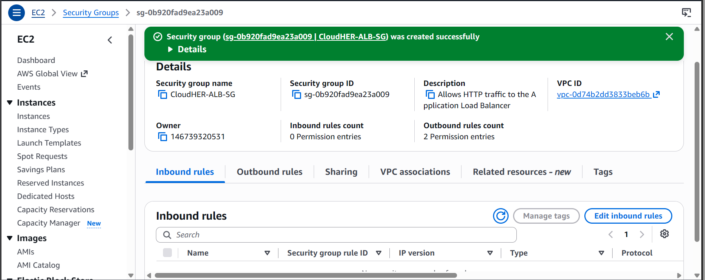
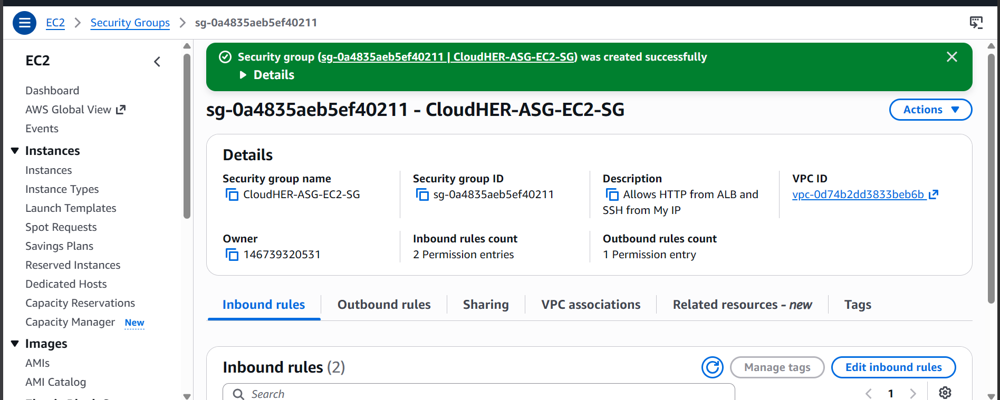
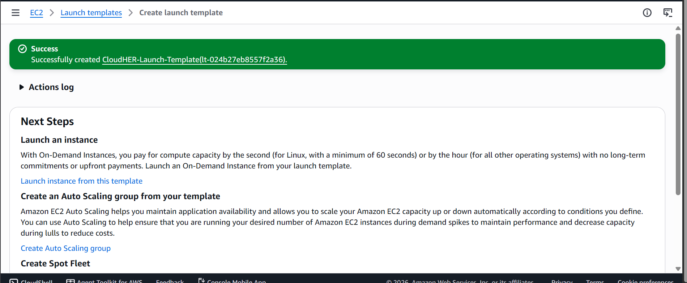
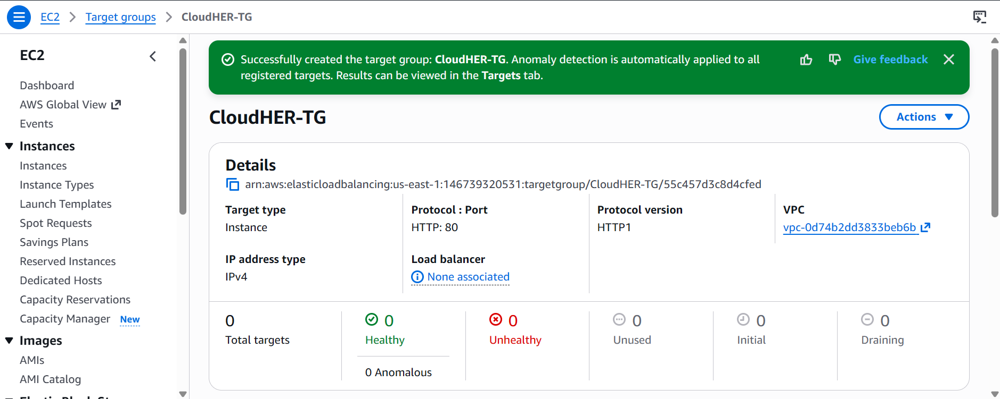
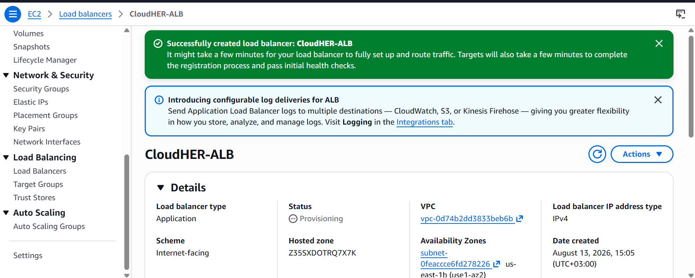
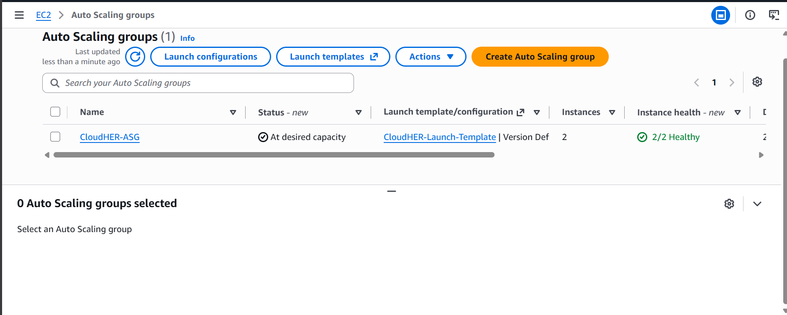
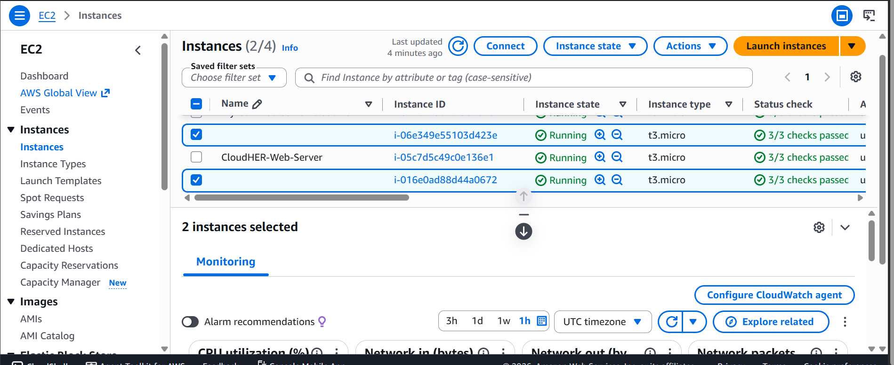
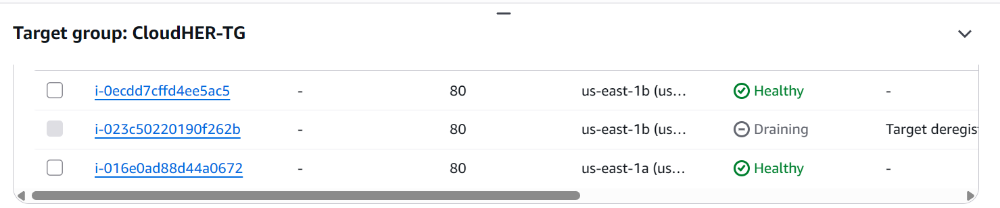
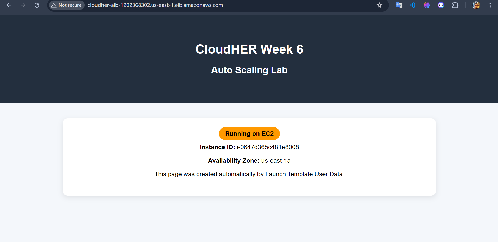
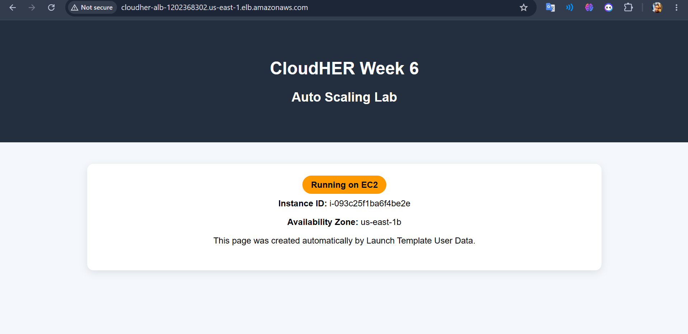

# AWS Auto Scaling & Application Load Balancer Lab

CloudHER by WIICA — Week 6 Project  
Amazon EC2 Auto Scaling + Application Load Balancer + Multi-AZ Deployment

---

## Table of Contents

- [Overview](#overview)
- [Architecture](#architecture)
- [Prerequisites](#prerequisites)
- [Project Structure](#project-structure)
- [Step-by-Step Guide](#step-by-step-guide)
- [Troubleshooting Notes](#troubleshooting-notes)
- [Testing Load Balancing](#testing-load-balancing)
- [Testing Auto Scaling](#testing-auto-scaling)
- [Deliverables Checklist](#deliverables-checklist)
- [Skills Demonstrated](#skills-demonstrated)
- [What I Learned](#what-i-learned)
- [Cleanup](#cleanup)
- [Author](#author)
- [Acknowledgements](#acknowledgements)
- [License](#license)

---

## Overview

This project is a hands-on AWS lab focused on **high availability, load balancing, and automatic scaling**.

The goal was to move from deploying a single EC2 web server to building a more resilient architecture where:

- An **Application Load Balancer (ALB)** distributes incoming HTTP traffic.
- An **Auto Scaling Group (ASG)** maintains the desired number of EC2 instances.
- EC2 instances are deployed across **multiple Availability Zones**.
- A **Launch Template** provides a consistent configuration for newly created instances.
- **Health checks** allow unhealthy instances to be replaced automatically.
- **CloudWatch metrics** can be used to trigger scale-out and scale-in events.

This lab builds directly on the networking concepts from the previous CloudHER VPC lab and demonstrates how those foundations support a production-style AWS architecture.

The most important lesson from this project was that **scaling is not simply launching more servers**. The servers need consistent configuration, healthy networking, correct security rules, and a load balancer capable of distributing traffic between them.

---

## Architecture

```text
                              Internet
                                  │
                                  ▼
                    ┌─────────────────────────┐
                    │  Application Load       │
                    │  Balancer (ALB)         │
                    │  Port 80 / HTTP         │
                    └────────────┬────────────┘
                                 │
                       Target Group :80
                                 │
                ┌────────────────┴────────────────┐
                │                                 │
                ▼                                 ▼
       ┌─────────────────┐              ┌─────────────────┐
       │   EC2 Instance  │              │   EC2 Instance  │
       │   us-east-1a    │              │   us-east-1b    │
       │                 │              │                 │
       │   Apache/httpd  │              │   Apache/httpd  │
       │   Web Server    │              │   Web Server    │
       └─────────────────┘              └─────────────────┘
                ▲                                 ▲
                │                                 │
                └──────────── Auto Scaling ───────┘
                              Group
                                 │
                                 ▼
                    ┌─────────────────────────┐
                    │    Launch Template      │
                    │                         │
                    │ Amazon Linux 2023       │
                    │ Apache                  │
                    │ User Data               │
                    │ IMDSv2 metadata calls   │
                    └─────────────────────────┘

                         CloudWatch
                             │
                             ▼
                   Scaling Policy / Alarm
                             │
                             ▼
                    ASG launches or
                    terminates instances
```

### Architecture Components

| Component | Purpose |
|---|---|
| Amazon VPC | Provides the network environment |
| Public Subnets | Host the internet-facing ALB and EC2 instances |
| Internet Gateway | Provides internet connectivity |
| Application Load Balancer | Distributes HTTP requests |
| Target Group | Registers and health-checks EC2 instances |
| Launch Template | Defines how new EC2 instances are created |
| Auto Scaling Group | Maintains the desired instance capacity |
| EC2 | Runs the Apache web application |
| CloudWatch | Provides monitoring and scaling metrics |
| Security Groups | Control inbound and outbound traffic |

---

## Prerequisites

Before starting this lab, you should have:

- An AWS account
- Basic knowledge of EC2 and VPC
- A working VPC with at least two Availability Zones
- Two public subnets in different Availability Zones
- An Internet Gateway
- Route tables configured for internet access
- A modern web browser
- Basic Linux command-line knowledge
- Git installed locally if cloning this repository

### AWS Region

This lab was completed in:

```text
US East (N. Virginia)
us-east-1
```

The EC2 instances were distributed across:

```text
us-east-1a
us-east-1b
```

Using multiple Availability Zones demonstrates the high-availability benefit of the architecture.

---

## Project Structure

```text
CLOUDHER-WEEK6-AUTOSCALING/
│
├── ec2-launch-template/
│   └── user_data.sh
│
├── lambda/
│
├── screenshots/
│   ├── lab1-autoscaling/
│   │   ├── 01a-alb-security-group.png
│   │   ├── 01b-ec2-security-group.png
│   │   ├── 02-launch-template.png
│   │   ├── 03-target-group.png
│   │   ├── 04-load-balancer.png
│   │   ├── 05-asg-config.png
│   │   ├── 06-ec2-instances-running.png
│   │   ├── 07-target-group-healthy.png
│   │   ├── 08a-alb-browser-test-1.png
│   │   └── 08a-alb-browser-test-2.png
│   │
│   └── lab2-eventdriven/
│
├── LICENSE
└── README.md
```

The repository is organized into two main labs:

- **Lab 1 — Auto Scaling:** EC2 Launch Template, Auto Scaling Group, Target Group, Application Load Balancer, health checks, and multi-AZ load balancing.
- **Lab 2 — Event Driven:** Lambda and event-driven architecture work.
- **Screenshots:** Visual evidence from the AWS console and browser tests is stored under `screenshots/lab1-autoscaling/`.


# Step-by-Step Guide

## Step 1: Prepare the VPC and Subnets

The Auto Scaling architecture requires networking that supports deployment across multiple Availability Zones.

The lab uses two public subnets:

```text
Public-Subnet-A → us-east-1a
Public-Subnet-B → us-east-1b
```

Both subnets must have:

```text
0.0.0.0/0 → Internet Gateway
```

This allows the EC2 instances and ALB to communicate with the internet.

### Why two Availability Zones?

If an entire Availability Zone becomes unavailable, instances in another Availability Zone can continue serving traffic.

This is one of the fundamental principles behind highly available AWS architectures.

---

## Step 2: Create the Security Groups

At least two security groups are useful for this architecture.

### ALB Security Group

Allow:

| Type | Protocol | Port | Source |
|---|---|---:|---|
| HTTP | TCP | 80 | `0.0.0.0/0` |

The ALB is the public entry point, so HTTP traffic can reach it from the internet.

### EC2 Security Group

Allow:

| Type | Protocol | Port | Source |
|---|---|---:|---|
| HTTP | TCP | 80 | ALB Security Group |

The important security improvement is that EC2 does not need to accept HTTP traffic directly from the entire internet.

Instead:

```text
Internet → ALB → EC2
```

This creates a cleaner security boundary.

---

## Step 3: Create the Launch Template

Create a Launch Template that defines the configuration of every EC2 instance launched by the Auto Scaling Group.

Example configuration:

```text
Name:
CloudHER-Launch-Template

AMI:
Amazon Linux 2023

Instance type:
t3.micro

Security group:
EC2 Web Security Group

Subnet:
Controlled by Auto Scaling Group

Public IP:
Enabled where required by the lab
```

The Launch Template is important because the ASG needs a repeatable definition of what a new instance should look like.

If an instance fails, the ASG can launch a replacement using the same configuration.

---

## Step 4: Configure EC2 User Data

The instances need to configure themselves automatically when they launch.

A simplified user-data script can:

1. Update packages.
2. Install Apache.
3. Enable Apache.
4. Start Apache.
5. Retrieve EC2 metadata using IMDSv2.
6. Create a webpage containing the instance ID and Availability Zone.

Example:

```bash
#!/bin/bash

dnf update -y
dnf install -y httpd curl

systemctl enable httpd
systemctl start httpd

TOKEN=$(curl -sS -X PUT \
  "http://169.254.169.254/latest/api/token" \
  -H "X-aws-ec2-metadata-token-ttl-seconds: 21600")

INSTANCE_ID=$(curl -sS \
  -H "X-aws-ec2-metadata-token: $TOKEN" \
  http://169.254.169.254/latest/meta-data/instance-id)

AZ=$(curl -sS \
  -H "X-aws-ec2-metadata-token: $TOKEN" \
  http://169.254.169.254/latest/meta-data/placement/availability-zone)

cat > /var/www/html/index.html <<EOF
<!DOCTYPE html>
<html>
<head>
    <title>CloudHER Auto Scaling Lab</title>
</head>
<body>
    <h1>CloudHER Auto Scaling Lab</h1>
    <p>Application Load Balancer is working.</p>
    <p><strong>Instance ID:</strong> $INSTANCE_ID</p>
    <p><strong>Availability Zone:</strong> $AZ</p>
</body>
</html>
EOF
```

### Why display the Instance ID?

The Instance ID makes it possible to visually prove that the ALB is distributing requests between different EC2 instances.

The Availability Zone provides additional evidence that the instances are distributed across multiple zones.

---

## Step 5: Create the Target Group

Create an EC2 target group.

Example:

```text
Target type:
Instances

Protocol:
HTTP

Port:
80

Health check protocol:
HTTP

Health check path:
/ 
```

The target group is responsible for determining whether registered EC2 instances are healthy enough to receive traffic.

A healthy target should eventually appear as:

```text
Health status: Healthy
```

---

## Step 6: Create the Application Load Balancer

Create an internet-facing Application Load Balancer.

Example:

```text
Name:
CloudHER-ALB

Scheme:
Internet-facing

IP address type:
IPv4

Listener:
HTTP : 80
```

Select public subnets in at least two Availability Zones.

Attach the ALB security group.

For the listener's default action:

```text
Forward to:
CloudHER Target Group
```

The resulting traffic flow is:

```text
Browser
   │
   ▼
ALB :80
   │
   ▼
Target Group
   │
   ├── EC2 us-east-1a
   │
   └── EC2 us-east-1b
```

---

## Step 7: Create the Auto Scaling Group

Create the Auto Scaling Group using the Launch Template.

Example:

```text
Name:
CloudHER-ASG

Launch Template:
CloudHER-Launch-Template

Minimum capacity:
2

Desired capacity:
2

Maximum capacity:
4
```

Select the two public subnets:

```text
us-east-1a
us-east-1b
```

Attach the existing target group.

Enable:

```text
Elastic Load Balancing health checks
```

This allows the Auto Scaling Group to consider load-balancer health when managing instances.

---

## Step 8: Verify the Instances

After the ASG launches the instances, open:

```text
EC2 → Instances
```

You should see two running instances.

The expected result is approximately:

```text
Instance 1 → us-east-1a
Instance 2 → us-east-1b
```

The exact Instance IDs will differ because AWS generates them dynamically.

Both instances should be registered with the target group.

---

## Step 9: Verify Target Health

Open:

```text
EC2
→ Target Groups
→ CloudHER Target Group
→ Targets
```

Wait until both targets show:

```text
Healthy
```

If a target is unhealthy, do not immediately recreate everything.

Troubleshoot in layers:

```text
EC2
  ↓
Apache
  ↓
Security Group
  ↓
Target Group
  ↓
ALB
  ↓
Browser
```

---

## Step 10: Test the Application Load Balancer

Copy the ALB DNS name.

It will look similar to:

```text
CloudHER-ALB-xxxxxxxx.us-east-1.elb.amazonaws.com
```

Open it in the browser using:

```text
http://<ALB-DNS-NAME>
```

The page should display:

```text
CloudHER Auto Scaling Lab

Application Load Balancer is working.

Instance ID: i-xxxxxxxxxxxxxxxxx
Availability Zone: us-east-1a
```

The exact values will vary.

---

# Troubleshooting Notes

This project included several real AWS troubleshooting scenarios. These were not simply configuration mistakes; they demonstrated how AWS components interact.

## 1. Instance ID and Availability Zone Appeared Blank

### Symptom

The webpage loaded successfully, but the following fields were empty:

```text
Instance ID:
Availability Zone:
```

The Apache server itself was working, so the problem was not the web server.

### Root Cause

The original `curl` calls were written using the older IMDSv1 metadata access pattern.

The AWS environment required **IMDSv2**, which requires a session token before metadata can be retrieved.

### Incorrect Approach

```bash
curl http://169.254.169.254/latest/meta-data/instance-id
```

### Correct IMDSv2 Approach

First request a token:

```bash
TOKEN=$(curl -X PUT \
  "http://169.254.169.254/latest/api/token" \
  -H "X-aws-ec2-metadata-token-ttl-seconds: 21600")
```

Then pass the token:

```bash
curl \
  -H "X-aws-ec2-metadata-token: $TOKEN" \
  http://169.254.169.254/latest/meta-data/instance-id
```

The same token-based approach was used for the Availability Zone.

### Lesson

A page can load correctly while application metadata is still broken.

Always distinguish between:

```text
Web server availability
```

and:

```text
Application configuration correctness
```

---

## 2. Missing Public IP / Subnet Configuration

During troubleshooting, one instance did not behave like the expected public-facing instance.

The investigation highlighted the importance of checking:

```text
VPC
→ Subnet
→ Route Table
→ Internet Gateway
→ Public IPv4 address
→ Security Group
```

A subnet being named "Public" does not automatically make an EC2 instance reachable from the internet.

For a public EC2 deployment, the relevant path must exist:

```text
Internet
   ↓
Internet Gateway
   ↓
Public Route Table
   ↓
Public Subnet
   ↓
EC2
```

The subnet also needs the appropriate public IPv4 configuration when the instance is expected to communicate directly with the internet.

---

## 3. Old Instance Still Running the Broken User Data

Another important issue occurred because the Auto Scaling Group had more than one instance created at different points during troubleshooting.

One older instance was still running the previous launch configuration while the newer replacement instance used the corrected configuration.

This produced inconsistent results.

### Investigation

The EC2 launch times revealed:

```text
Older instance
→ launched approximately one hour earlier

Newer instance
→ launched approximately eleven minutes earlier
```

The older instance had not been replaced.

### Resolution

The old instance was terminated manually.

The Auto Scaling Group detected that capacity had fallen below the desired capacity and automatically launched a replacement using the corrected configuration.

### Lesson

When troubleshooting Auto Scaling, always verify:

- Instance launch time
- Launch Template version
- User Data
- Availability Zone
- Target health
- ASG activity history

Two instances in the same ASG can temporarily behave differently if they were created from different configurations.

---

## 4. Why Launch Template Versions Matter

Updating a Launch Template does not necessarily rewrite already-running EC2 instances.

Existing instances continue running the configuration they were launched with.

The Launch Template is primarily used when AWS launches a new instance.

Therefore:

```text
Old Instance
     │
     └── Keeps old configuration

New Instance
     │
     └── Uses selected Launch Template version
```

This is why terminating an incorrectly configured instance can cause the ASG to replace it with a correctly configured instance.

---

## 5. Troubleshooting Method

The most useful diagnostic sequence from this lab was:

```text
1. Check the EC2 instance
2. Check Apache
3. Check User Data
4. Check instance metadata
5. Check Security Groups
6. Check subnet and route table
7. Check Target Group health
8. Check ALB
9. Check browser
10. Check Auto Scaling Activity history
```

This prevents random configuration changes and makes the troubleshooting process reproducible.

---

# Visual Evidence

The screenshots below document the actual AWS resources and testing performed during Lab 1.

## 1. Application Load Balancer Security Group

The ALB security group allows HTTP traffic on port 80 from the internet.



---

## 2. EC2 Security Group

The EC2 security group controls access to the web servers.



---

## 3. Launch Template

The Launch Template defines the configuration used when the Auto Scaling Group creates EC2 instances.



---

## 4. Target Group

The Target Group registers the EC2 instances and performs health checks before allowing them to receive traffic.



---

## 5. Application Load Balancer

The internet-facing Application Load Balancer receives incoming HTTP traffic and forwards requests to healthy targets.



---

## 6. Auto Scaling Group Configuration

The Auto Scaling Group maintains the desired EC2 capacity and launches replacement instances when necessary.



---

## 7. EC2 Instances Running

The final deployment contains EC2 instances distributed across Availability Zones.



---

## 8. Target Group Health Checks

Both EC2 instances were successfully registered with the Target Group and reached a healthy state.



---

## 9. ALB Browser Test — Instance 1

The ALB successfully served the application from one of the EC2 instances. The page displays the Instance ID and Availability Zone, allowing the load-balancing behavior to be verified.



---

## 10. ALB Browser Test — Instance 2

Refreshing the ALB endpoint produced a response from the other EC2 instance, demonstrating traffic distribution across the deployment.



> **Note:** The second browser screenshot is named `08a-alb-browser-test-2.png` in the repository, so the README intentionally uses that exact filename.

---

# Testing Load Balancing

The first major validation was proving that the ALB could distribute requests between two different EC2 instances.

The webpage was intentionally designed to display:

```text
Instance ID
Availability Zone
```

Refresh the ALB URL multiple times.

You should eventually see responses from different instances.

Example:

### Request 1

```text
Instance ID: i-0647d365c481e8008
Availability Zone: us-east-1a
```

### Request 2

```text
Instance ID: i-093c25f1ba6f4be2e
Availability Zone: us-east-1b
```

The exact behavior and ordering can vary because load-balancing decisions are handled by AWS.

### Evidence

The two instances used during the final validation were:

```text
i-0647d365c481e8008 → us-east-1a
i-093c25f1ba6f4be2e → us-east-1b
```

Both instances were populated correctly after the IMDSv2 fix.

The browser evidence is embedded directly in the [Visual Evidence](#visual-evidence) section above:

```text
screenshots/lab1-autoscaling/08a-alb-browser-test-1.png
screenshots/lab1-autoscaling/08a-alb-browser-test-2.png
```

These screenshots provide visual evidence that the ALB is serving responses from different instances across different Availability Zones.

---

# Testing Auto Scaling

The next stage is to demonstrate that the Auto Scaling Group can respond to increased demand.

## Step 1: Configure a Scaling Policy

A target tracking policy can use average CPU utilization.

Example:

```text
Metric:
Average CPU Utilization

Target:
50%
```

The ASG can then launch additional instances when average CPU utilization rises above the configured target.

---

## Step 2: Generate CPU Load

Connect to an EC2 instance and generate CPU activity.

For example, a controlled Linux CPU workload can be used during the lab.

One possible approach is:

```bash
sudo dnf install stress-ng -y
stress-ng --cpu 2 --timeout 300s
```

> Use CPU-load commands carefully and only for the duration required by the lab.

---

## Step 3: Monitor CloudWatch

Open:

```text
CloudWatch
→ Metrics
→ EC2
→ Auto Scaling
```

Monitor:

```text
CPUUtilization
```

The goal is to observe CPU usage increasing enough to trigger the configured scaling policy.

---

## Step 4: Monitor ASG Activity

Open:

```text
EC2
→ Auto Scaling Groups
→ CloudHER-ASG
→ Activity
```

A successful scale-out should produce an activity event indicating that an additional instance was launched.

The desired capacity may change from:

```text
2
```

to:

```text
3
```

depending on the scaling policy.

---

## Step 5: Verify the New Instance

Once the new instance launches:

```text
EC2 → Instances
```

Confirm that the new instance:

- Is running
- Uses the expected Launch Template
- Has the expected User Data configuration
- Registers with the target group
- Becomes healthy
- Can serve the application through the ALB

This completes the basic Auto Scaling validation.

---

# Deliverables Checklist

- [ ] Custom VPC configured
- [ ] Two public subnets across different Availability Zones
- [ ] Internet Gateway configured
- [ ] Correct route table associations
- [ ] ALB security group configured
- [ ] EC2 security group configured
- [ ] Launch Template created
- [ ] Amazon Linux 2023 configured
- [ ] Apache installed automatically using User Data
- [ ] IMDSv2 implemented in User Data
- [ ] Target Group created
- [ ] Application Load Balancer created
- [ ] Auto Scaling Group created
- [ ] Minimum/desired/maximum capacity configured
- [ ] Both initial instances healthy
- [ ] ALB successfully served the application
- [ ] Instance ID displayed correctly
- [ ] Availability Zone displayed correctly
- [ ] Traffic verified across two instances
- [ ] CPU load test completed
- [ ] Auto Scaling scale-out event observed
- [ ] ALB and EC2 security-group screenshots captured
- [ ] Launch Template screenshot captured
- [ ] Target Group screenshot captured
- [ ] Load Balancer screenshot captured
- [ ] Auto Scaling Group configuration screenshot captured
- [ ] EC2 instances screenshot captured
- [ ] Healthy targets screenshot captured
- [ ] Two ALB browser-test screenshots captured
- [ ] Screenshots saved in `screenshots/lab1-autoscaling/`

---

# Skills Demonstrated

### AWS Cloud

- Amazon EC2
- Amazon VPC
- Application Load Balancer
- Auto Scaling Groups
- Launch Templates
- Target Groups
- CloudWatch
- Security Groups
- Availability Zones
- Internet Gateways
- Route Tables

### Linux

- Amazon Linux 2023
- `dnf`
- `systemctl`
- Apache HTTP Server
- Bash scripting
- `curl`
- EC2 Instance Metadata Service

### DevOps / Infrastructure

- Automated instance provisioning
- Infrastructure configuration
- Health checks
- Load balancing
- Horizontal scaling
- Multi-AZ architecture
- Configuration consistency
- Failure replacement

### Troubleshooting

- IMDSv2 debugging
- User Data debugging
- Security Group analysis
- Public IP troubleshooting
- Launch Template version analysis
- Target Group health analysis
- ASG Activity investigation
- Layer-by-layer cloud troubleshooting

---

# What I Learned

This lab changed how I think about scalability in AWS.

### 1. Load balancing and auto scaling solve different problems

The ALB answers:

> "Which healthy instance should receive this request?"

The ASG answers:

> "How many instances should exist?"

Together they provide a scalable application architecture.

---

### 2. Auto Scaling depends heavily on consistent configuration

If one instance has a broken User Data script and another has a corrected version, the ASG can appear inconsistent even though the infrastructure is technically working.

This reinforced the importance of:

```text
Launch Template
        ↓
Consistent User Data
        ↓
Consistent Instances
```

---

### 3. IMDSv2 is important

The metadata troubleshooting was one of the most valuable parts of the lab.

The issue demonstrated that AWS security controls can affect scripts that appear correct at first glance.

The corrected architecture now explicitly requests an IMDSv2 token before accessing metadata.

---

### 4. Multi-AZ deployment improves availability

Running instances in:

```text
us-east-1a
us-east-1b
```

means that the application is not dependent on a single Availability Zone.

---

### 5. Health checks are critical

The ALB does not simply send traffic to every registered instance.

It uses health checks to determine which targets are healthy.

This means an instance can be running at the EC2 level while still being unhealthy from the application's perspective.

---

### 6. Troubleshooting should be systematic

The biggest practical lesson was:

```text
Don't guess.
Trace the request.
```

For this architecture:

```text
Browser
   ↓
ALB
   ↓
Target Group
   ↓
Security Group
   ↓
EC2
   ↓
Apache
   ↓
Application
```

Testing each layer makes cloud troubleshooting much faster and more reliable.

---

# Cleanup

AWS resources can generate charges if left running.

After completing the lab and capturing the required evidence, clean up resources that are no longer needed.

Recommended cleanup order:

1. Delete or scale down the Auto Scaling Group.
2. Terminate remaining EC2 instances.
3. Delete the Application Load Balancer.
4. Delete the Target Group.
5. Delete unused Launch Templates.
6. Delete unused Security Groups.
7. Remove unnecessary CloudWatch alarms.
8. Delete unused networking resources if they were created specifically for this lab.
9. Verify the AWS Billing dashboard.

> Always review the AWS console before cleanup so you do not accidentally delete resources belonging to another project.

---

# Author

**Daniel Nzioki Musyoka**

Data & AI | Cloud Computing | Data Engineering | DevOps

GitHub: [Daniel059](https://github.com/Daniel059)

Portfolio: [Daniel Nzioki Musyoka — Data & AI Portfolio](https://daniel-nzioki-musyoka-data-and-ai-pro.netlify.app/)

---

# Acknowledgements

This project was completed as part of the **CloudHER by WIICA** Cloud Computing mentorship program.

Special appreciation to my mentor **Rajpreet Gill** for her guidance, technical direction, and encouragement throughout the CloudHER journey.

The project provided an opportunity to move beyond individual AWS services and understand how multiple cloud components work together to build a more resilient architecture.

I am especially grateful for the troubleshooting experience gained from this lab. The issues involving public connectivity, IMDSv2, User Data, Launch Template versions, and Auto Scaling behavior turned configuration problems into practical cloud engineering lessons.

---

# License

This project is intended for **educational and portfolio purposes**.

---

> 💡 **Tip for future me:** Don't just ask whether an EC2 instance is running. Ask whether it is correctly configured, healthy, reachable, registered with the load balancer, and replaceable by the Auto Scaling Group. Cloud infrastructure is a system of connected components — troubleshoot the path, not just the symptom.
